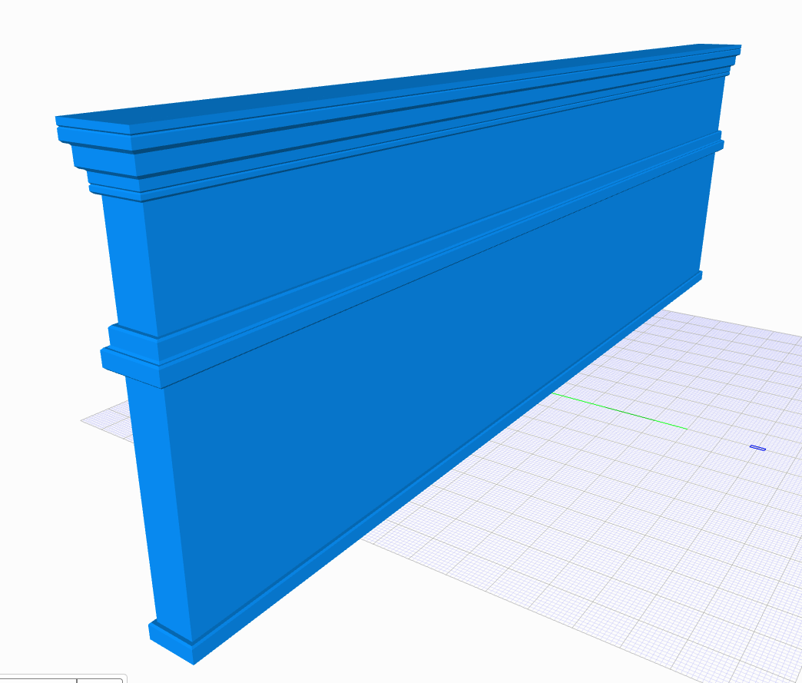
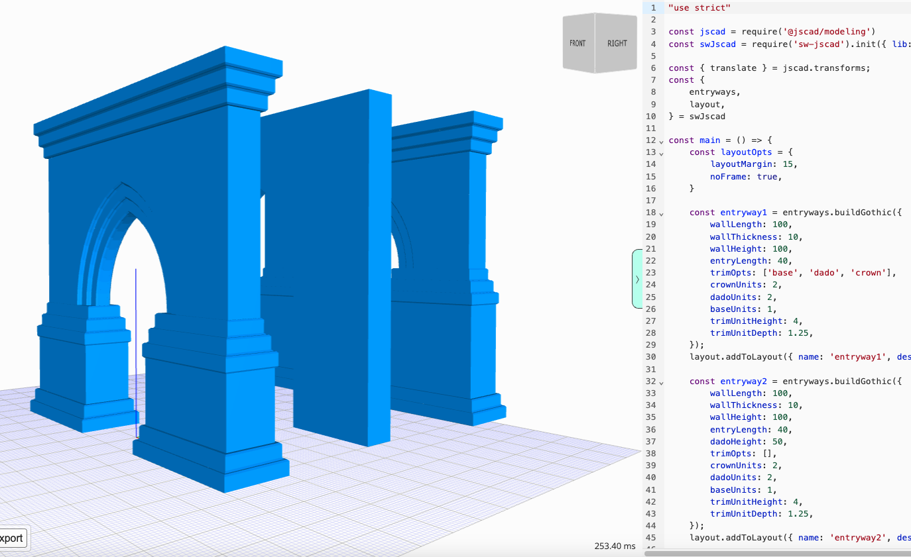

# sw-jscad-ui

UX functionality for sw-jscad and sw-jscad-viewer.

Online viewer: [sw-jscad-viewer.netlify.app/](https://sw-jscad-viewer.netlify.app/)  
API Docs: [salvador-workshop.github.io/sw-jscad/](https://salvador-workshop.github.io/sw-jscad/)  
NPM package: [npmjs.com/package/sw-jscad](https://www.npmjs.com/package/sw-jscad)  

")
")



## Usage

Works with JSCAD, however you consume it.

```javascript
"use strict"
const jscad = require('@jscad/modeling')

const swJscad = require('sw-jscad').init({ lib: jscad });
const swjUi = require('sw-jscad-ui').init({ lib: jscad, swLib: swJscad });
const swjFamilies = require('sw-jscad-families').init({ lib: jscad, swLib: swJscad });
const swjBuilders = require('sw-jscad-builders').init({ lib: jscad, swLib: swJscad, swFamilies: swjFamilies });

const {
    arches,
    columns,
    walls,
} = swjBuilders

const {
    foils,
    moulds,
    profiles,
} = swJscad.details

const {
    trimAranea,
} = swjFamilies

const {
    layout,
} = swjUi.ux

const main = () => {
    const layoutOpts = {
        layoutMargin: 18,
        layoutSpace: 5,
    }


    //-----------
    // Profiles

    const profile1 = profiles.sqCornerCircNotch({ sqLength: 5 });
    const profile3 = profiles.octagonal({ sqLength: 5 });

    const tFamilyBasic = trimAranea.buildTrimFamily({ unitHeight: 20, unitDepth: 10 });
    const dadoTrim = [
        tFamilyBasic.dado.small,
        tFamilyBasic.dado.medium,
        tFamilyBasic.dado.large,
        tFamilyBasic.dado.mediumOrn1,
    ];
    dadoTrim.forEach((trim, idx) => {
        layout.addToLayout({ name: `dado-${idx}`, desc: '...', geom: trim, layoutOpts });
    })


    //-----------
    // Mouldings

    const mould3 = moulds.circularMoulding({ radius: 20, height: 5 }, profile1);
    layout.addToLayout({ name: 'mould3', desc: '...', geom: mould3, layoutOpts });


    //-----------
    // Foils

    const foil1 = foils.trefoil({ radius: 10 });
    layout.addToLayout({ name: 'foil1', desc: '...', geom: foil1, layoutOpts });

    const foil5 = foils.quatrefoil({ radius: 10, lobeRadiusType: 'inSlice' });
    layout.addToLayout({ name: 'foil5', desc: '...', geom: foil5, layoutOpts });

    const foil7 = foils.trefoil({ radius: 15, lobeRadiusType: 'halfRadius', cutCentre: true }, profile1);
    layout.addToLayout({ name: 'foil7', desc: '...', geom: foil7, layoutOpts });

    const foil8 = foils.quatrefoil({ radius: 15, lobeRadiusType: 'mean', cutCentre: true }, profile3);
    layout.addToLayout({ name: 'foil8', desc: '...', geom: foil8, layoutOpts });


    //-----------
    // Columns

    const col2 = columns.threePtColumn({
        base: ['roundCylinder', 2, 3.5],
        shaft: ['extrude', null, profile1],
        capital: ['roundCylinder', 2, 3.5],
        height: 20,
    });
    layout.addToLayout({ name: 'col2', desc: '...', geom: col2, layoutOpts });


    //-----------
    // Arches

    const arch1 = arches.twoPtArch({ arcRadius: 30, archWidth: 35, profileWidth: 5 }, profile1);
    layout.addToLayout({ name: 'arch1', desc: '...', geom: arch1, layoutOpts });

    const arch2 = arches.twoPtArch({ arcRadius: 30, archWidth: 35 });
    layout.addToLayout({ name: 'arch2', desc: '...', geom: arch2, layoutOpts });


    //-----------
    // Walls

    const wall2 = walls.buildWall({
        height: 100,
        thickness: 10,
        length: 80,
        // wallOpts: 0,
        trimOpts: ['base', 'crown'],
        crownUnits: 1,
        baseUnits: 2,
        trimUnitHeight: 4,
        trimUnitDepth: 1.25,
        trimSides: 4,
    });
    layout.addToLayout({ name: 'Wall (2)', desc: '...', geom: wall2, layoutOpts });

    const wallDado1 = walls.buildWall({
        height: 100,
        thickness: 10,
        length: 70,
        // wallOpts: 0,
        trimOpts: ['base', 'dado', 'crown'],
        dadoUnits: 1,
        trimUnitHeight: 4,
        trimUnitDepth: 1.25,
        trimSides: 4,
    });
    layout.addToLayout({ name: 'Dado Wall (1)', desc: '...', geom: wallDado1, layoutOpts });

    const layoutContent = layout.gridLayout({ layoutOpts });
    return layoutContent;
}

module.exports = { main }
```

## Packages

The toolkit is composed of several packages, arranged in a layered architecture.


| Package | Documentation | NPM |
| --- | --- | --- |
| sw-jscad | [salvador-workshop.github.io/sw-jscad/](https://salvador-workshop.github.io/sw-jscad/) | [npmjs.com/package/sw-jscad](https://www.npmjs.com/package/sw-jscad) |
| sw-jscad-families | [salvador-workshop.github.io/sw-jscad-families](https://salvador-workshop.github.io/sw-jscad-families/)| [npmjs.com/package/sw-jscad-families](https://www.npmjs.com/package/sw-jscad-families) |
| sw-jscad-std-specs | [salvador-workshop.github.io/sw-jscad-std-specs](https://salvador-workshop.github.io/sw-jscad-std-specs/) | [npmjs.com/package/sw-jscad-std-specs](https://www.npmjs.com/package/sw-jscad-std-specs) |
| sw-jscad-ui | [salvador-workshop.github.io/sw-jscad-ui](https://salvador-workshop.github.io/sw-jscad-ui/)| [npmjs.com/package/sw-jscad-ui](https://www.npmjs.com/package/sw-jscad-ui) |
| sw-jscad-builders | [salvador-workshop.github.io/sw-jscad-builders](https://salvador-workshop.github.io/sw-jscad-builders/)| [npmjs.com/package/sw-jscad-builders](https://www.npmjs.com/package/sw-jscad-builders) |
| sw-jscad-factory | ... | ... |

### Core packages

The _core packages_ power everything

| Package | Description |
| --- | --- |
| sw-jscad | JSCAD library for parametric modelling of architectural components |
| sw-jscad-families | Designs groups of related models |
| sw-jscad-std-specs | Definitions for building elements and various standards/specs |
| sw-jscad-ui | UX, layouts, etc |

### Sub packages

The _sub packages_ build larger and more complicated components using the core packages as building blocks.

| Package | Description |
| --- | --- |
| sw-jscad-builders | Tools and functions for building assemblies |
| sw-jscad-factory | Doesn't exist yet. For larger and more complicated assemblies, compared to the `builders` package |
